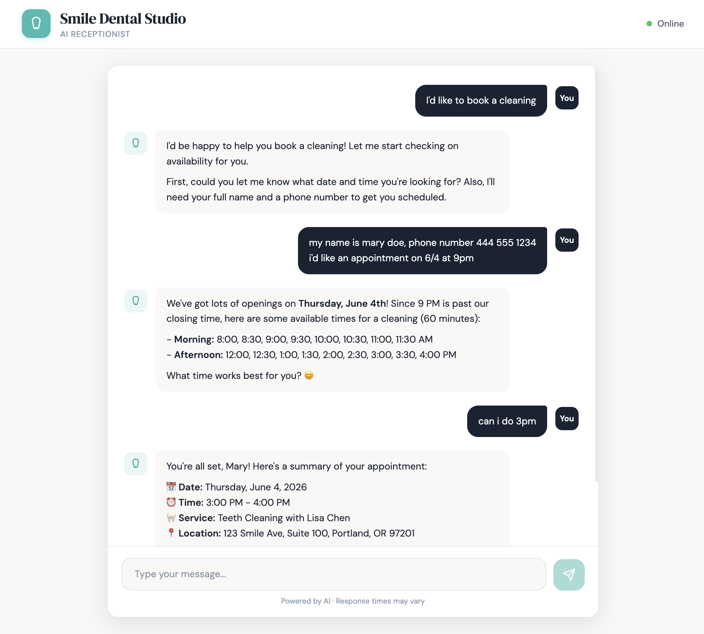
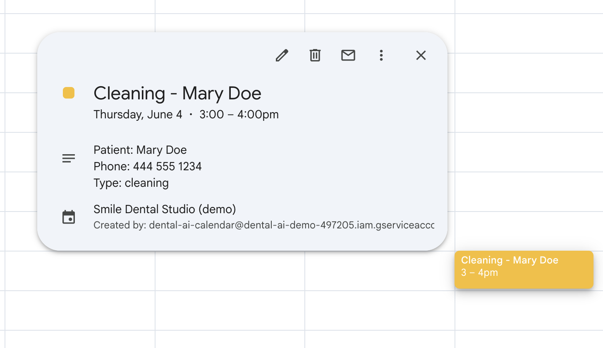

# Dental AI Receptionist

An AI-powered receptionist for dental offices that handles appointment booking, rescheduling, cancellations, and answers common patient questions — all through a real-time chat interface connected to Google Calendar.

**[Try the live demo →](https://web-production-691b.up.railway.app/)**

## What It Does

- **Books appointments** — checks real-time availability on Google Calendar and creates events
- **Reschedules & cancels** — finds existing appointments by patient name or phone and modifies them
- **Answers common questions** — insurance accepted, office hours, services offered, cancellation policy, emergency procedures, payment methods
- **Handles edge cases** — rejects past dates, closed days (Sundays), suggests alternatives when slots are full
- **Conversation memory** — maintains context across a multi-turn booking flow (collects name, phone, preferred time naturally)
- **Config-driven** — swap a single YAML file to serve a different dental office

<p align="center">
  
  <br>
  <em>AI receptionist booking a cleaning appointment</em>
</p>

<p align="center">
  
  <br>
  <em>Appointment automatically created on Google Calendar</em>
</p>

## How It Works

```
Patient → Chat UI → FastAPI Backend → LLM (DeepSeek/OpenAI/Claude) → Tool Calls → Google Calendar API
```

The LLM acts as the receptionist's "brain." It receives patient messages and decides which tools to call:

| Tool | What it does |
|------|-------------|
| `check_availability` | Queries Google Calendar free/busy slots for a date |
| `book_appointment` | Creates a calendar event with patient details |
| `find_appointment` | Searches upcoming events by name or phone |
| `reschedule_appointment` | Moves an existing event to a new time |
| `cancel_appointment` | Deletes a calendar event |
| `get_office_info` | Returns office details from the YAML config |

## Tech Stack

- **Backend:** Python, FastAPI
- **LLM:** Any OpenAI-compatible API (DeepSeek, OpenAI, Claude, etc.)
- **Calendar:** Google Calendar API with service account auth
- **Frontend:** Vanilla HTML/CSS/JS — single file, no build step
- **Deployment:** Railway

## Cost Breakdown

Running this in production costs very little:

| Component | Cost |
|-----------|------|
| DeepSeek v4-flash | ~$0.001-0.003 per conversation |
| Google Calendar API | Free (up to 1M queries/day) |
| Railway hosting | ~$5/month |
| **Total** | **~$5-10/month for a small practice** |

Swapping to OpenAI GPT-4o or Claude would increase the LLM cost to ~$0.02-0.05 per conversation — still negligible.

## Setup

### Prerequisites

- Python 3.9+
- A Google Cloud project with Calendar API enabled
- A Google Calendar shared with a service account
- An API key from [DeepSeek](https://platform.deepseek.com/) (or any OpenAI-compatible provider)

### 1. Clone and install

```bash
git clone https://github.com/lienmly/dental-ai-receptionist.git
cd dental-ai-receptionist
pip install -r requirements.txt
```

### 2. Set up Google Calendar

1. Go to [Google Cloud Console](https://console.cloud.google.com/)
2. Create a project and enable the **Google Calendar API**
3. Create a **Service Account** under Credentials
4. Download the JSON key file and save it as `service-account.json` in the project root
5. Create a new Google Calendar (e.g., "Smile Dental Studio")
6. Share it with the service account email (found in the JSON file under `client_email`) — give it **Make changes to events** permission
7. Copy the **Calendar ID** from calendar settings

### 3. Configure environment

Copy `.env.example` to `.env` and fill in your values:

```bash
cp .env.example .env
```

```
LLM_API_KEY=your-deepseek-api-key
LLM_BASE_URL=https://api.deepseek.com
LLM_MODEL=deepseek-v4-flash
GOOGLE_CALENDAR_ID=your-calendar-id@group.calendar.google.com
GOOGLE_SERVICE_ACCOUNT_FILE=service-account.json
```

### 4. Customize the dental office

Edit `app/config/office.yaml` to match your practice — name, hours, providers, services, insurance, policies. The AI receptionist automatically uses whatever you put in this file.

### 5. Run

```bash
python3 -m uvicorn app.main:app --reload --port 8000
```

Open `http://localhost:8000` and start chatting.

## Customization

### Swap the LLM

Change three values in `.env`:

```
# OpenAI
LLM_API_KEY=sk-...
LLM_BASE_URL=https://api.openai.com/v1
LLM_MODEL=gpt-4o

# DeepSeek
LLM_API_KEY=sk-...
LLM_BASE_URL=https://api.deepseek.com
LLM_MODEL=deepseek-v4-flash
```

### Deploy to Railway

1. Push to GitHub
2. New Railway project → Deploy from GitHub
3. Add environment variables (use `GOOGLE_SERVICE_ACCOUNT_JSON` with the full JSON content instead of the file path)
4. Generate a domain under Settings → Networking

## Project Structure

```
dental-ai-receptionist/
├── app/
│   ├── main.py              # FastAPI app + chat endpoint
│   ├── config/
│   │   ├── settings.py       # Environment config
│   │   ├── loader.py         # YAML config loader + system prompt builder
│   │   └── office.yaml       # Dental office configuration
│   ├── services/
│   │   ├── llm.py            # LLM adapter (OpenAI-compatible)
│   │   └── calendar.py       # Google Calendar integration
│   └── tools/
│       ├── definitions.py    # LLM tool/function schemas
│       └── handler.py        # Tool execution router
├── frontend/
│   └── index.html            # Chat UI (single file)
├── requirements.txt
├── Procfile                  # Railway deployment
├── .env.example
└── README.md
```

## License

MIT — use it however you want.